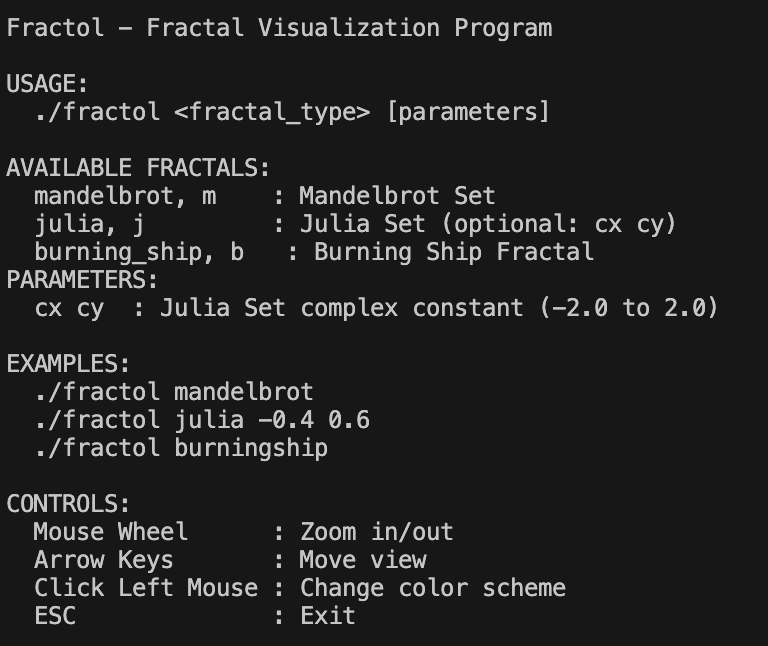

# Fractol

Interactive fractal visualization program with real-time rendering and navigation controls.

## Features

- **Fractals**: Mandelbrot Set, Julia Set, Burning Ship
- **Navigation**: Mouse wheel zoom, arrow key movement
- **Colors**: 5 different color palettes (cycle with mouse click)

## Screenshots

| Mandelbrot Set | Julia Set | Burning Ship Fractal |
|:--------------:|:---------:|:--------------------:|
|  |  |  |

## 🚀 Installation

### Install Dependencies
```bash
# Install GLFW via Homebrew
brew install glfw

# Install cmake (required for MLX42)
brew install cmake
```

### Build the Project
```bash
# Clone and navigate to the project
git clone <https://github.com/lanfeitiao/fractol.git>
cd fractol

# Compile the project
make

# The executable 'fractol' will be created in the root directory
```

## 🎮 Usage

```bash
# Display usage information
./fractol
```



**Interesting Julia Set parameters**:
- `./fractol julia -0.4 0.6` - Classic Julia set
- `./fractol julia 0.285 0.01` - Spiral pattern
- `./fractol julia -0.8 0.156` - Lightning-like pattern

## 🎯 Controls

| Control | Action |
|---------|--------|
| **Mouse Wheel** | Zoom in/out |
| **↑ ↓ ← →** | Navigate around the fractal |
| **Left Mouse Click** | Cycle through color palettes |
| **ESC** | Exit the program |

## 🎨 Color Palettes

The program includes several stunning color palettes:

1. **Earth & Sky**: Natural colors transitioning from earth tones to sky blues
2. **Fire**: Hot colors ranging from black through red, orange to white
3. **Blue Gold**: Elegant blue to gold gradient
4. **Hot & Cold**: Temperature-based color mapping
5. **Pastels**: Soft, gentle color transitions

## 🧮 Mathematical Background

### Mandelbrot Set
The Mandelbrot set is all complex numbers c for which, if you start at 0 and repeatedly apply z → z² + c, the values never fly off to infinity.

### Julia Set
Julia sets are defined by the iteration z_{n+1} = z_n² + c, where c is a fixed complex parameter and z₀ varies across the complex plane.

### Burning Ship Fractal
Similar to the Mandelbrot set, but with the iteration z_{n+1} = (|Re(z_n)| + i|Im(z_n)|)² + c.

---

**Enjoy exploring the infinite beauty of fractals! 🌌**